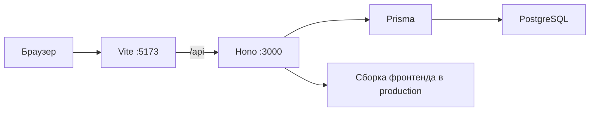

<div align="center">

# Доска схем

[](https://github.com/just05me/mind-map)

Веб-приложение для карт архитектуры и статусов задач: модули, сервисы, API, агенты и заметки на одном холсте.

[](https://react.dev/)
[](https://www.typescriptlang.org/)
[](https://vite.dev/)
[](https://hono.dev/)
[](https://www.prisma.io/)
[](https://www.postgresql.org/)

[](https://github.com/just05me/mind-map/stargazers)
[](https://github.com/just05me/mind-map/commits/main)
[](https://github.com/just05me/mind-map/issues)

[Сайт](https://ffinance.uz) · [Репозиторий](https://github.com/just05me/mind-map)

<p>
  <a href="https://skillicons.dev">
    
  </a>
</p>

</div>

---

## Содержание

- [О проекте](#о-проекте)
- [Возможности](#возможности)
- [Стек](#стек)
- [Как это устроено](#как-это-устроено)
- [Локальный запуск](#локальный-запуск)
- [Деплой через Docker](#деплой-через-docker)
- [Как пользоваться](#как-пользоваться)
- [Импорт макета из JSON](#импорт-макета-из-json)
- [Структура](#структура)
- [Скрипты](#скрипты)

## О проекте

На одной карте можно собрать систему: входы, модули, сервисы, хранилища, API, агентов, очереди и свои типы. Узлы связываются подписанными стрелками. Тот же граф открывается видом **Статусы** — колонки «Задумано», «В работе», «Готово», «Сломано».

После регистрации схемы пишутся в PostgreSQL у аккаунта. В браузере остаётся локальный кэш (`localStorage`): старые JSON и импорт по-прежнему читаются. Очистка хранилища сайта не удаляет проекты на сервере.

Редактор в духе FigJam: отмена и повтор, копирование, рамки, стикеры, комментарии, решения.

## Возможности

| | |
| --- | --- |
| **Схема** | Холст на [XYFlow](https://reactflow.dev/): узлы, стикеры, текст, рамки, комментарии, решения, подписанные связи |
| **Статусы** | Те же элементы по колонкам: задумано, в работе, готово, сломано |
| **Типы узлов** | Входы, модули, сервисы, хранилища, API, агенты, очереди, вебхуки и свои типы |
| **Правка как в Figma** | Отмена и повтор, копирование, дублирование, контекстное меню, панель над выделением |
| **Просмотр** | Режим без редактирования: можно двигать холст, менять масштаб и выбирать элементы |
| **Панели** | «Элементы» слева и «Свойства» справа, скрываются с холста |
| **Проекты** | Создание, дублирование, удаление, переключение |
| **Аккаунт** | Регистрация и вход по почте и паролю; после входа схемы синхронизируются с сервером |
| **Экспорт** | JSON, Markdown и PNG схемы |
| **Импорт** | Проект целиком или макет с координатами от центра доски |
| **Промпт для ИИ** | Спецификация формата макета одной кнопкой в буфер обмена |
| **Автораскладка** | Слева направо, сверху вниз или показать всё |
| **Темы** | Светлая и тёмная |

## Стек

| Слой | Технологии |
| --- | --- |
| Интерфейс | React 19, TypeScript, Vite 7, Tailwind CSS 4, Motion |
| Холст | [@xyflow/react](https://reactflow.dev/), Dagre |
| API | Hono на Node, JWT в httpOnly cookie |
| Данные | Prisma, PostgreSQL |
| Запуск | Docker Compose (приложение + база) |

## Как это устроено

```text
UI (canvas / board / ui)
  → useApp / dispatch
  → reducer
  → Project в сторе + /api/projects
  → PostgreSQL
```

- Правила графа, undo и владение данными — в `src/store` и `src/model`, не в узлах.
- XYFlow рисует холст, это не второй источник истины.
- После входа проекты уходят на API; без сессии остаётся локальный кэш.
- Пользователи и ACL — только в `server/`. Из React в базу ходить нельзя.



В dev Vite проксирует `/api` на `http://127.0.0.1:3000`. В production тот же процесс отдаёт API и папку `dist`.

## Локальный запуск

Нужны [Node.js](https://nodejs.org/) 20+, npm и PostgreSQL (удобно через Docker).

```bash
cp .env.example .env
docker compose up db -d
npm install
npx prisma migrate deploy
npm run dev
```

Откройте **http://localhost:5173/**

Сервер Vite слушает IPv4 (`127.0.0.1`) и IPv6 (`::1`), поэтому адрес открывается в Chrome и в Safari. Если Safari сам подставляет `https://`, введите URL вручную с `http://`. Запасной адрес: http://127.0.0.1:5173/

Сборка и просмотр фронтенда:

```bash
npm run build
npm run preview
```

`preview` тоже ходит в `/api` на порт 3000 — оставьте `npm run dev:server` или `npm start`.

## Деплой через Docker

1. Скопируйте `.env.example` в `.env` на сервере.
2. Задайте **случайный** `SESSION_SECRET` (не короче 32 символов) и сильный `POSTGRES_PASSWORD`. Не оставляйте значения из примера.
3. Укажите `CORS_ORIGIN` — точный origin сайта, например `https://boards.example.com`.
4. Соберите и запустите:

```bash
docker compose up --build -d
```

Приложение слушает **http://localhost:3000/** (API и собранный фронтенд в одном контейнере). Проверка: `GET /api/health` должен вернуть `{ "ok": true, "db": "up" }`.

Отдельного демо-пользователя в образе нет: создайте аккаунт на экране регистрации.

## Как пользоваться

1. Зарегистрируйтесь или войдите.
2. Добавьте элемент: инструмент на нижней панели, тип из панели «Элементы» (клик или перетаскивание) или правая кнопка по холсту. Двойной клик по пустому холсту создаёт текст.
3. Соедините узлы: наведите на узел и потяните от точки на краю к другому узлу. Если отпустить на пустом месте, появится новый связанный узел.
4. Выделенный элемент можно перекрасить, дублировать или удалить с панели над ним, клавишей Delete или через правую кнопку. У выбранной связи меняются подпись, цвет и толщина в панели «Свойства». Ошиблись — ⌘Z.
5. Перетащите узел в рамку, чтобы сгруппировать; вытащите за её край, чтобы вынуть.
6. Панели скрываются кнопкой в их заголовке, клавишами `[` и `]` или ⌘\ для обеих.
7. Переключатель **Схема / Статусы** в шапке меняет вид, элементы общие.
8. Кнопка **Правка / Просмотр** в шапке включает режим, где нельзя менять доску, но можно кликать элементы и читать свойства.
9. Все горячие клавиши — по `?` или значку клавиатуры в шапке.
10. Доску можно не рисовать руками: на пустом холсте есть кнопки **Импортировать макет** и **Промпт для ИИ** — см. [Импорт макета из JSON](#импорт-макета-из-json).

Удаление аккаунта из интерфейса не предусмотрено.

## Импорт макета из JSON

Файл читают два места: кнопка **Импортировать макет** на пустом холсте и пункт **Проекты → Импорт из JSON…**. Понимаются два вида файлов:

- **проект целиком** — то, что отдаёт «Экспорт → JSON», и готовые доски из `boards/`: позиции узлов абсолютные;
- **макет** — файл с полем `format` или `coordinateSpace`: координаты задаются от центра доски.

Обратная совместимость определяется этим признаком: если в JSON нет ни `format`, ни `coordinateSpace: "center"`, координаты читаются как абсолютные, ровно как раньше.

В макете `x` и `y` — смещение **центра** бокса от центра доски (`0,0`), а у вложенного узла — от центра его рамки. Приложение переводит их в абсолютные позиции, растягивает рамку, если дети не влезают, и подгоняет масштаб под содержимое.

```json
{
  "format": "mind-map.layout.v1",
  "coordinateSpace": "center",
  "title": "Чат с ИИ",
  "nodes": [
    { "id": "f", "type": "frame", "title": "Клиент", "x": -560, "y": 0, "width": 520, "height": 380 },
    { "id": "page", "kind": "entry", "title": "Страница чата", "parentId": "f", "x": 0, "y": -70 },
    { "id": "api", "kind": "api", "title": "POST /api/chat", "x": 0, "y": 0, "status": "doing" }
  ],
  "edges": [{ "source": "page", "target": "api", "label": "запрос" }]
}
```

Спецификацию не нужно держать в голове: кнопка **Промпт для ИИ** (на пустом холсте и в меню «Экспорт») копирует в буфер готовый русский текст — типы узлов, каталог kinds вместе со своими типами, статусы, правила координат и пример. Вставьте его в ChatGPT или Claude, допишите задачу, ответ сохраните файлом и импортируйте.

Битый файл ничего не ломает: приложение показывает короткую ошибку, подставляет значения по умолчанию вместо пропущенных полей и отбрасывает связи с несуществующими узлами. Импорт в пустой проект заполняет его, иначе появляется новый проект.

## Структура

| Папка | Содержимое |
| --- | --- |
| `src/model` | Типы, каталог узлов, статусы, цвета, бумага холста |
| `src/canvas` | Схема: холст, узлы, связи, меню, подсказки |
| `src/board` | Вид по статусам |
| `src/ui` | Шапка, панели, меню, иконки, экраны входа |
| `src/store` | Состояние проектов, история правок, API и сессия |
| `src/export` | JSON, Markdown, PNG и скачивание |
| `src/lib` | Общие мелочи: id и анимация |
| `server/` | API: авторизация, проекты, Prisma |
| `boards/` | Готовые JSON проектов |
| `scripts/` | Генераторы JSON в `boards/` |
| `landing/` | Отдельный маркетинговый сайт (не входит в Docker-сборку приложения) |

## Скрипты

| Команда | Назначение |
| --- | --- |
| `npm run dev` | Vite и API вместе |
| `npm run dev:web` | Только Vite |
| `npm run dev:server` | Только API |
| `npm run build` | Проверка TypeScript и продакшен-сборка |
| `npm start` | Запуск собранного API (раздаёт фронтенд в production) |
| `npm run preview` | Локальный просмотр сборки фронтенда |
| `npm run db:deploy` | Применить миграции Prisma |

---

<div align="center">

Если доска полезна — поставьте звезду репозиторию.

[](https://github.com/just05me/mind-map)

</div>
